# 基于Springboot的网上超市

## Springboot-0025


## 技术栈

Springboot mybatisplus vue mysql maven


## 数据库表(14张)


## 功能介绍

```properties
管理员
实现功能包括管理员：首页、个人中心、商品评价管理、商品信息管理、订单管理、用户管理、商品分类管理、系统管理
```


## 图片

### 前台


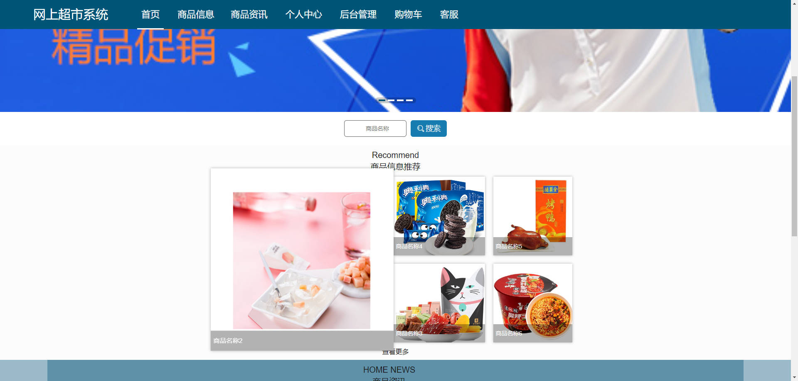


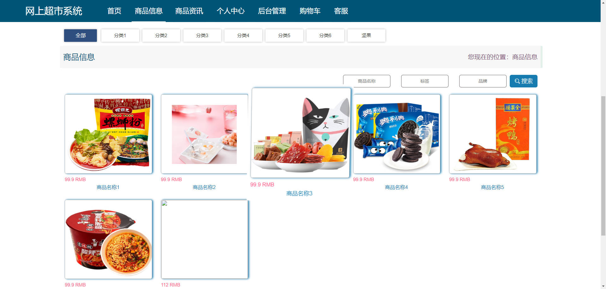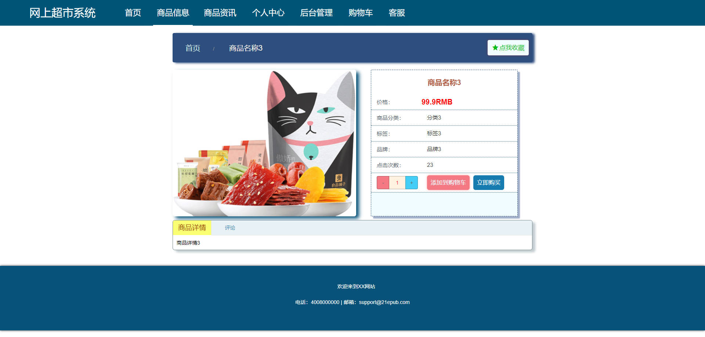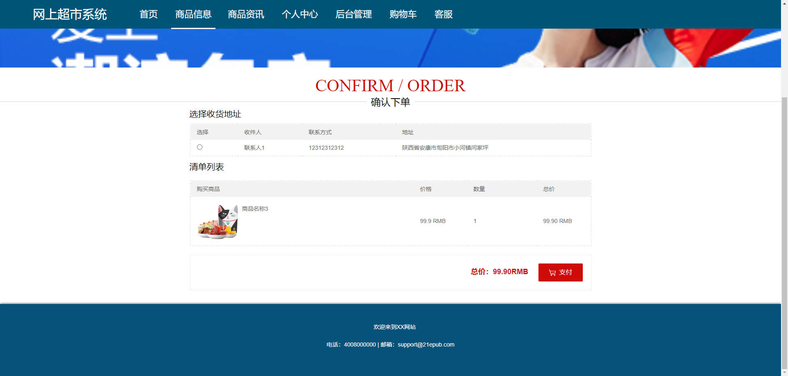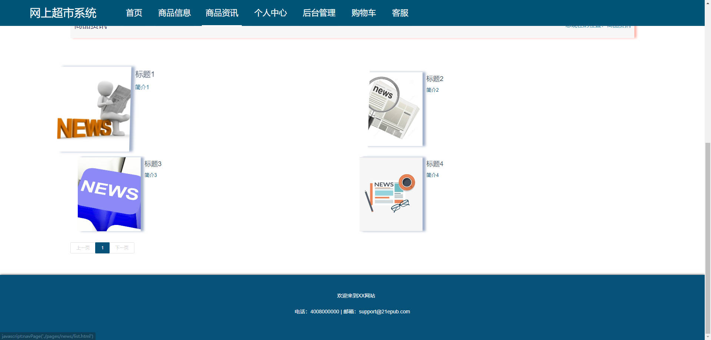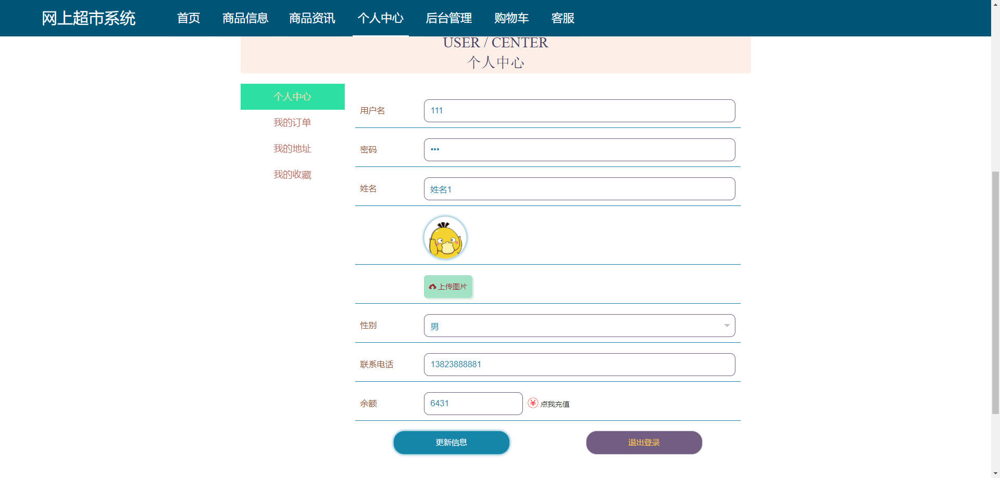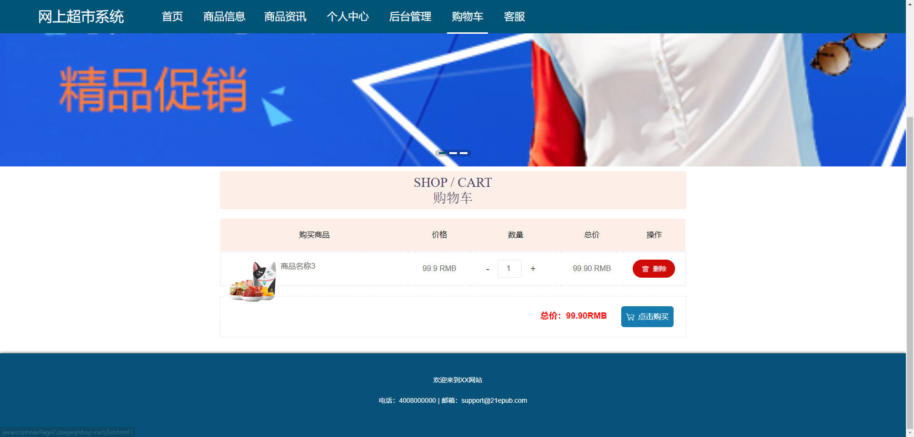

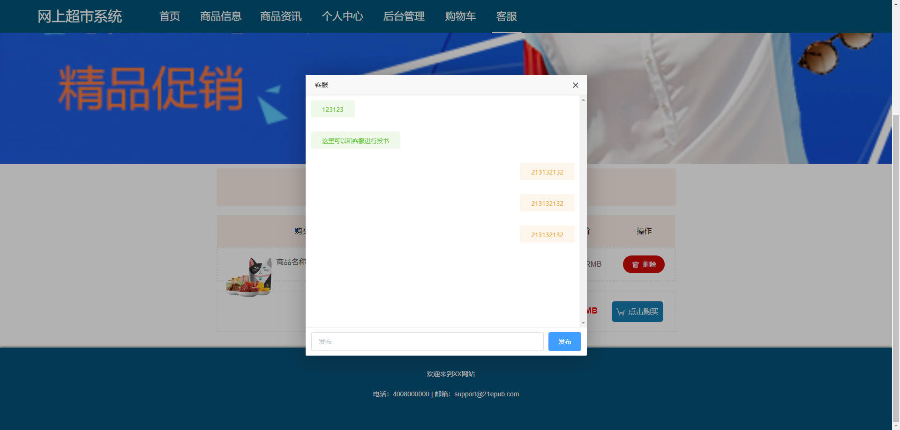

### 后台

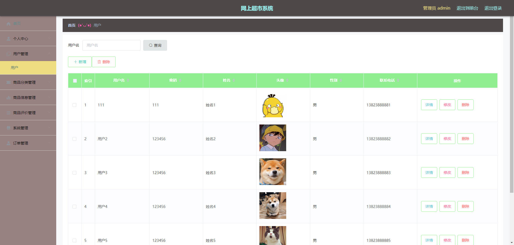

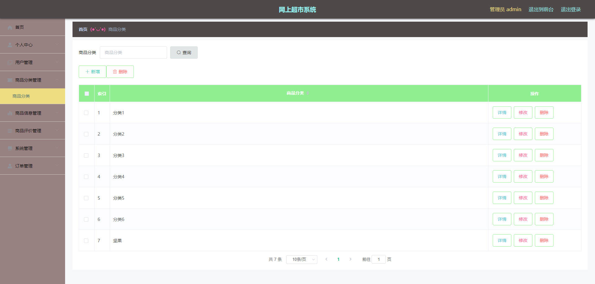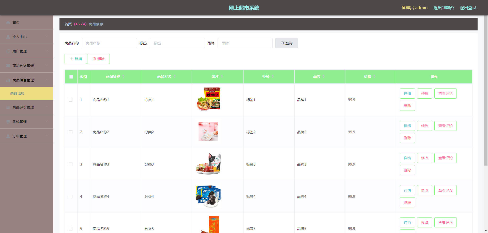

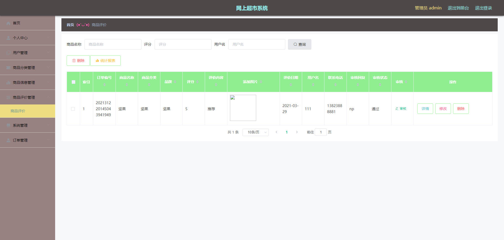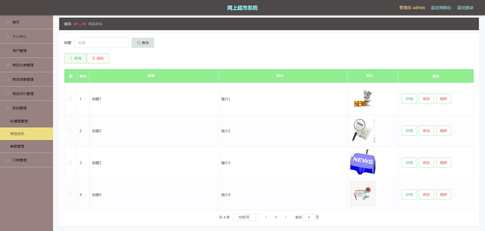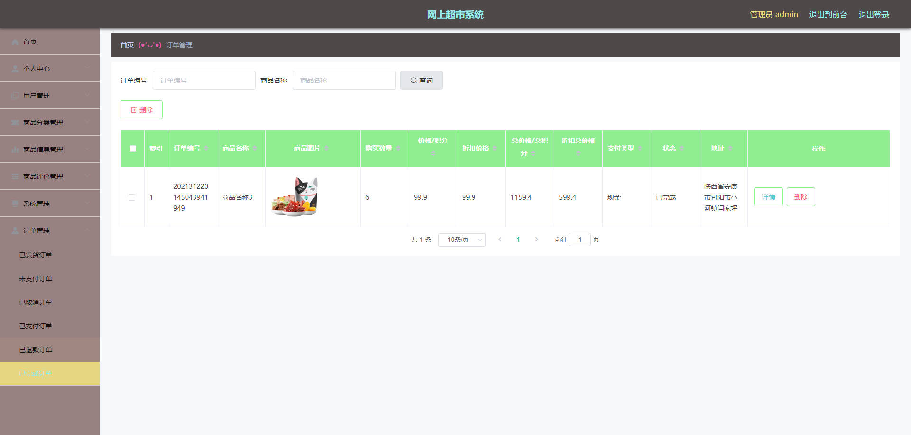

## 访问路径

### 前台

```properties
http://localhost:8080/wangshangchaoshi/front/pages/login/login.html

账号 111
密码 111
```

### 后台

```properties
http://localhost:8080/wangshangchaoshi/admin/dist/index.html#/login

账号 admin
密码 admin
```


## 功能图

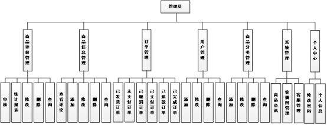


## 文档目录

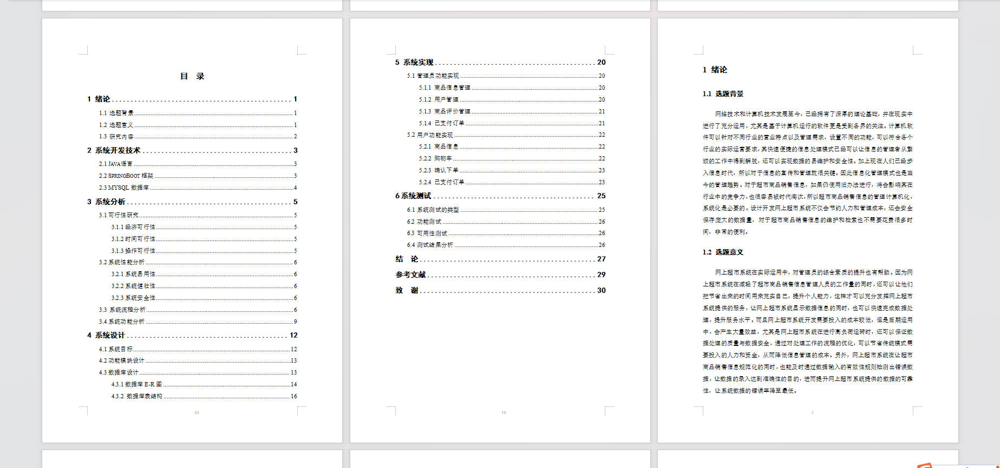


## 打赏或交流


